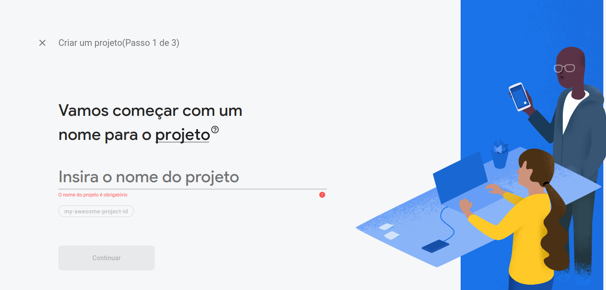
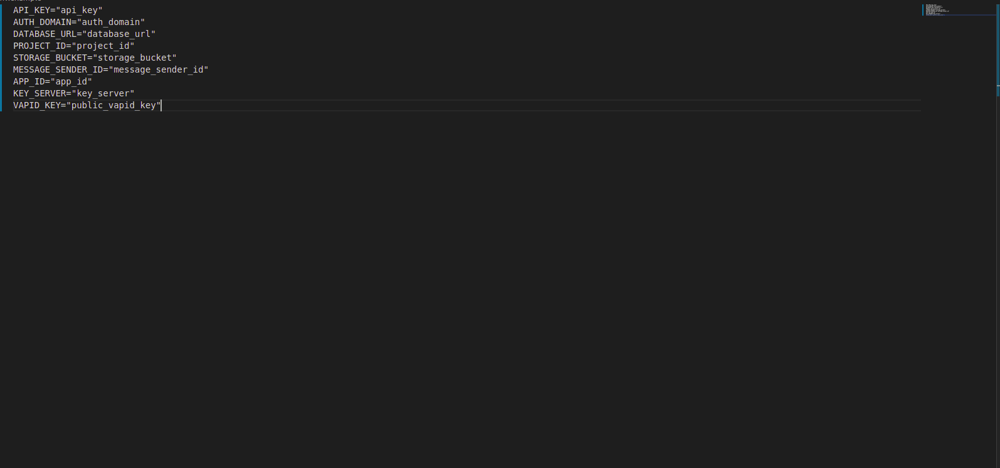
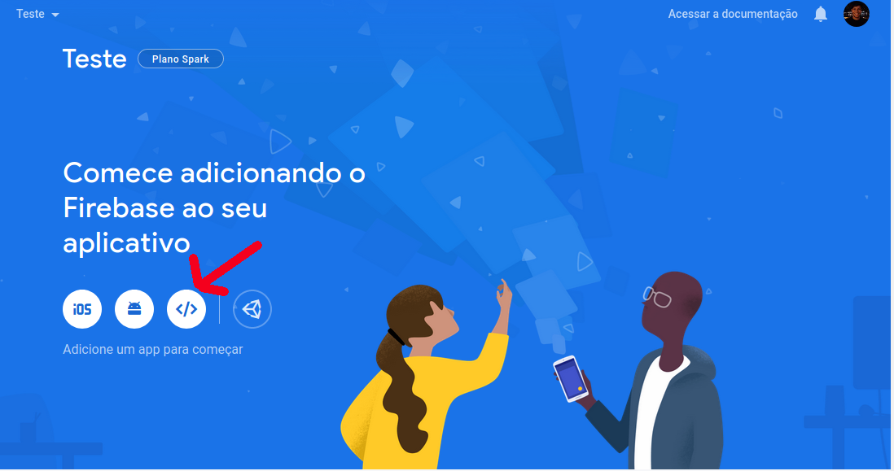
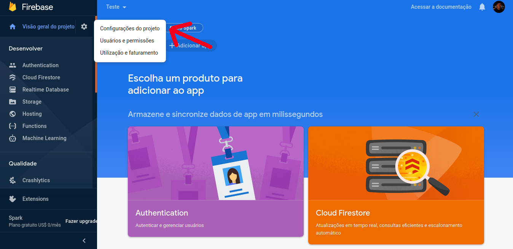
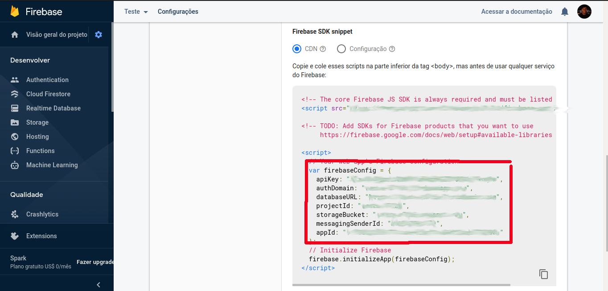
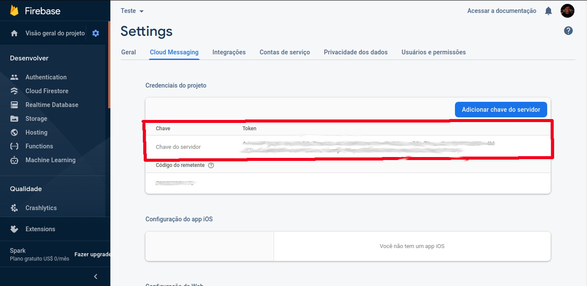

# Sistema de Gestão Energética da Universidade de Brasília - SIGE

## About

The Energy Management System (Sistema de Gestão Energética SIGE-UnB) developed by Univerity of Brasilia (Brazil) in partnership with CEB (Companhia Energética de Brasília), is a web application developed to assist in the monitoring and management of Universidade de Brasília's power consumption and distribution.

The idea is to monitor, collect and display data of each campus power supply, allowing a much better comprehension of the usage patterns and energy quality received from the distribution station.

The system is divided into four main layers:

- the **web presentation layer**, which holds the front-end of the application, including the dashboard for researchers.
- the **mobile presentation layer**, which holds the PWA mobile version of the front-end of the application.
- the **master server** layer, which is responsible for all the data management, data processing, and database redundancy.
- the **slave server** layer is responsible for the communication with energy transductors and data collection.

This reposotory holds the source code for the **mobile presentation layer** layer.

## License

All SIGE source code is licensed under [GPL v3](https://gitlab.com/lappis-unb/projects/SMI/smi-front/-/blob/development/LICENSE)

## How to run
To run the mobile front-end, execute the following command:

```
docker-compose up
```
The default container port exposed for the server is `8081`. For accessing the application go to `http://localhost:8081/` on a browser.

##  API connection
The app is tied to the [Master API ](https://gitlab.com/lappis-unb/projects/SMI/smi-master). 
The defaul configuration is set to connect to the `master-api` container running on the same machine. 
For a different setup configure the Master API address by altering the `baseURL` variable in the file  `src/services/masterApi/http-common.js`. 


## Enable Push notification  
***Android only***

Here we'll show step by step how to enable push notification with firebase in this project.

### 1. Create a firebase project: 
***If you already have an project then you can skip this step***

After sign into your firebase console, follow the steps to create a new project.



### 2. Create a .env file

You'll need to create file called ***.env*** , this file need to be a copy of [.env.example](https://gitlab.com/lappis-unb/projects/SMI/smi-mobile/-/blob/development/.env.example) 

### 3. Fill .env file



After finished steps to add a project, go to configurations.



At the end of the page you'll see the informations that we need.



Right, now we need of two more data, to have our .env complete, these data will be found in Cloud Messaging tab

* Server Key 
* Vapid Key
    * Generate Vapid Key 
    * Vapid Key 

### 4. Receive Notifications 

Now you're able to receive notifications, our app work with [firebase topics](https://firebase.google.com/docs/cloud-messaging/android/topic-messaging), we defined a topic to send and receive notifications, we defined this [topic](https://gitlab.com/lappis-unb/projects/SMI/smi-mobile/-/blob/development/src/store/module-notification/mutations.js#L2), this topic must be the same of our sender [master](https://gitlab.com/lappis-unb/projects/SMI/smi-master/-/blob/development/events/models.py#L15).